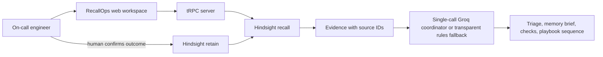

# RecallOps

**Incident response that remembers.** RecallOps helps on-call engineers investigate repeat incidents by retrieving relevant postmortems, highlighting both failed fixes and verified resolutions, and turning that evidence into a cautious investigation plan.

> RecallOps is advisory only. It does not connect to production systems, execute commands, restart services, roll back releases, or change infrastructure.

## The problem

Incident knowledge is scattered across tickets, chat threads, and postmortems. During an outage, responders lose time rebuilding context—and can repeat a fix that already failed. RecallOps connects today's symptoms and recent changes to the team's historical experience, then makes the supporting evidence inspectable.

## What the demo does

1. **Describe an incident** — Choose one of three clearly labelled fictional scenarios or enter synthetic symptoms, service, environment, impact, and recent change.
2. **Recall relevant experience** — Hindsight retrieves related memories. The UI shows source IDs and whether evidence is live Hindsight memory, synthetic sample data, or a browser-local lesson.
3. **Coordinate four specialist roles in one model call** — Incident Triage, Memory Scout, Read-only Planner, and Playbook Composer return structured summaries, cited hypotheses, observational checks, and a reusable sequence. This is one on-demand request—not four parallel agents or background workers. Without Groq credentials, the evidence-guided rules fallback keeps the demo functional and identifies itself honestly.
4. **Compare memory vs. no memory** — A side-by-side panel makes the value of prior experience visible. A past incident is framed as a hypothesis to test, never as proof.
5. **Close the learning loop** — An engineer records a confirmed root cause, failed actions, successful resolution, and follow-up lesson. A required human confirmation precedes saving.
6. **Use that lesson next time** — In live mode, the lesson is retained in Hindsight and can inform later recall. In simulation mode, the lesson is stored only in that browser's local storage.
7. **Inspect usage and retention** — The Usage & audit workspace charts live API actions, rolling request-limit usage, recent metadata-only events, and expiry. Standard users see their own activity; admins can view workspace totals with pseudonymous labels and export a filtered CSV. Reviewers without an account can choose **View synthetic preview** or open `/?section=usage&sample=1`; signed-in users can also switch between live and sample views. Generated sample numbers never query or write real analytics.

## Why Hindsight is central

RecallOps uses Hindsight as a persistent experience layer, not a transcript cache or an extra database:

- **Recall:** the server calls the official `@vectorize-io/hindsight-client` SDK with the incident service, symptoms, and recent change. Retrieved facts are assigned citation IDs and shown next to the recommendation they informed.
- **Retain:** only a human-confirmed postmortem is sent to Hindsight, including what failed, what worked, and a caution that historical similarity is not proof.
- **Idempotent demo seeding:** synthetic postmortems use stable document IDs, so loading the sample pack again updates those demo documents instead of duplicating them.
- **Learning progression:** a retained outcome can change evidence and prioritization on a later analysis. This is memory-augmented reasoning; **the language model is not being retrained**.
- **Private per-user isolation:** live operations require Manus sign-in. The server derives an opaque bank ID from the authenticated OAuth identity using the stable server-side `JWT_SECRET`; the raw identity and bank ID are never returned to the browser.

Each signed-in user has a separate Hindsight bank. The former shared hackathon bank is not used by live application requests. Keep `JWT_SECRET` stable: rotating it changes the derived bank IDs and requires a deliberate bank migration to retain access to old memories.

## Architecture



**Stack:** React + TypeScript + Tailwind, tRPC, Node/Express, the official Hindsight TypeScript client, and optional Groq Chat Completions. Credentials are read server-side only; they are never sent to the browser.

## Run locally

Requirements: Node.js 20+ and pnpm.

```bash
pnpm install
# Optional: set HINDSIGHT_API_URL, HINDSIGHT_API_KEY, and GROQ_API_KEY
# in the server process environment. Never use a VITE_ prefix for secrets.
pnpm dev
```

Open the local URL printed by the dev server. The app works without credentials in **simulation mode** using fictional seed incidents. Simulation mode is visibly labelled; its postmortems are persisted to that browser only, not to Hindsight.

### Optional integrations

| Variable                      | Purpose                                                                                                                        |
| ----------------------------- | ------------------------------------------------------------------------------------------------------------------------------ |
| `HINDSIGHT_API_URL`           | Base URL of your Hindsight API instance (omit `/v1`); obtain the correct URL from your Hindsight deployment or Cloud settings. |
| `HINDSIGHT_API_KEY`           | Optional for local/self-hosted Hindsight with auth disabled; set the server-side bearer key when API-key auth is enabled.      |
| `VITE_OAUTH_PORTAL_URL`       | Manus sign-in portal base URL used by the client.                                                                              |
| `VITE_APP_ID`                 | Registered RecallOps app ID used by the sign-in flow.                                                                          |
| `OAUTH_SERVER_URL`            | Server-side OAuth token/user-info service URL.                                                                                 |
| `DATABASE_URL`                | Required for live user sessions, durable request limits, and audit records.                                                    |
| `JWT_SECRET`                  | Required stable server secret for session signing and per-user private-bank derivation.                                        |
| `GROQ_API_KEY`                | Optional server-side key for Groq evidence-grounded plan generation.                                                           |
| `GROQ_MODEL`                  | Optional Groq model name for the one-request specialist coordinator; defaults to `openai/gpt-oss-120b`.                        |
| `RECALLOPS_AGENT_COORDINATOR` | Optional kill switch; set to `false` to force the deterministic rules fallback.                                                |

The runtime intentionally ignores any legacy `HINDSIGHT_BANK_ID` setting: live bank IDs are derived server-side per signed-in account. Live mode also requires the managed MySQL tables in `drizzle/schema.ts`; for a fresh environment, configure `DATABASE_URL` and apply the generated Drizzle migration before enabling live operations. The WebDev demo database already has the security tables applied.

`HINDSIGHT_API_URL` can point to Hindsight Cloud or a self-hosted API. Hindsight bearer authentication uses `Authorization: Bearer <key>` through the official SDK. Never put either provider key in a `VITE_` variable, client code, screenshots, or a public commit. See the [Hindsight quickstart](https://hindsight.vectorize.io/developer/api/quickstart), [retain guide](https://hindsight.vectorize.io/developer/api/retain), and [recall guide](https://hindsight.vectorize.io/developer/api/recall).

The optional Groq path defaults to `openai/gpt-oss-120b` and makes at most one model request per analysis, capped at 3,000 generated tokens. That request coordinates four bounded roles—Incident Triage, Memory Scout, Read-only Planner, and Playbook Composer—using strict JSON Schema output. The server then validates evidence IDs and filters unsafe action-like plan items. These are logical prompt roles, not independent agents with separate calls, credentials, or tools. Set `RECALLOPS_AGENT_COORDINATOR=false` to force the transparent rules fallback. See the [official Groq model page](https://console.groq.com/docs/model/openai/gpt-oss-120b), [Structured Outputs guide](https://console.groq.com/docs/structured-outputs), and [`docs/GROQ_REFERENCES.md`](docs/GROQ_REFERENCES.md).

When live OAuth, database, and Hindsight settings are configured, open **Memory bank → Sign in for your private pack**. The app carries that explicit, one-use seed request across the OAuth redirect (for up to 10 minutes), loads the fictional postmortems into the signed-in user's private bank, and opens **Usage & audit** to verify the live seed event. Generic sign-in never seeds automatically. Then open **Incident room**, choose a scenario, and run analysis. A verified outcome is retained only after the human-confirmation control is checked. Without Hindsight configuration, the app stays in visibly labelled simulation mode and performs no private-bank write.

### Data handling and limitations

- The hosted hackathon demo is intended for **fictional/synthetic incident data only**. Do not enter production logs, personal information, credentials, or secrets.
- The server redacts common token/key patterns before sending user text to configured external APIs; this is a safeguard, not a guarantee of complete secret detection.
- API keys stay server-side. Live operations require authentication and use a private bank per user. Persistent request limits allow 30 live actions per user per minute and fail closed if the managed database is unavailable.
- The database audit log stores only a pseudonymous actor hash plus action type and fixed target label—not incident text, email, or OAuth IDs—and deletes audit rows after 30 days. Hindsight memory has its own provider-side retention controls.
- The audit dashboard is authenticated and role-scoped: personal by default, with workspace analytics reserved for admins. Workspace user labels are pseudonymous; CSV exports contain only the already-authorized metadata view.
- Signed-in users see private in-app warnings at 80% of their 30-request/minute limit and a critical alert if it is exceeded. Admin workspace analytics show the same thresholds with pseudonymous labels, plus unusual spikes (at least 10 requests and 3× the median of at least three active peers). These are heuristic signals, not proof of misuse; they are derived from the current request window, are not separately retained, and are not sent to an external channel.
- A Hindsight URL failure is surfaced as synthetic fallback evidence, explicitly marked as such. An empty live bank is not silently represented as a successful recall.
- Recommendations are hypotheses. The interface requests read-only checks, filters unsafe action-like model output, and never executes a remediation.
- The specialist coordinator receives the redacted incident fields and the current analysis's retrieved evidence only. Specialist outputs are returned for the current view; intermediate reasoning is not stored in the audit database. Usage alerts remain deterministic and actor-level audit rows are never sent to the model.
- Synthetic metrics and incident histories are illustrative, not measured production results. No accuracy or time-saving claims are made.
- The in-browser simulation stores outcomes in `localStorage`; live Hindsight mode retains confirmed outcomes in the configured bank.

### Future telemetry or ticketing integration scope (not connected)

Before connecting an operational source, keep the initial integration read-only and allowlist only a stable source record ID, service/environment label, severity, event timestamp, short sanitized symptom summary, and a change or runbook reference. Exclude raw logs/traces, request or response bodies, attachments, credentials, personal data, and customer identifiers. Source payloads should be used transiently for the current investigation and not copied into the audit database. Only a human-confirmed, sanitized outcome may be retained as a private Hindsight memory. App audit metadata retains its existing 30-day TTL; source-side telemetry/ticket retention and Hindsight memory expiry remain separately controlled and must be reviewed with the chosen provider before enabling a connector. RecallOps will not write tickets or perform remediation.

## Verify

```bash
pnpm check
pnpm test
pnpm build
```

## Hackathon demo flow

1. Open the **Checkout 502s** synthetic scenario and point out the recent worker-concurrency change.
2. Analyze and inspect `[E1]`: a fictional earlier incident where restarts failed and a verified config rollback restored service. Point out the Incident Triage, Memory Scout, Read-only Planner, and Playbook Composer sections are produced in one call.
3. Show the memory delta: generic release/metrics checks become a more specific _hypothesis_ to compare configuration and queue telemetry—still not a confirmed diagnosis. Open **Playbooks** to review the cited, read-only sequence from the same analysis.
4. Record a human-confirmed outcome, explicitly noting what failed and what resolved it.
5. Run analysis again. Show the newly retained or browser-local lesson as evidence and explain the difference between live Hindsight and simulation mode.

A fuller timed script, article draft, and social copy are in [`docs/SUBMISSION_KIT.md`](docs/SUBMISSION_KIT.md).

## Project status

This repository contains the interactive hackathon demo and setup/submission materials, including authenticated per-user live banks, durable rate limits, 30-day pseudonymous audit retention, and the interactive Usage & audit workspace. It does not connect to an organization's telemetry or ticketing system; any such integration requires a separate data-access, privacy, and retention review. The OAuth live path should be exercised by each account before loading synthetic starter memories into that account's private bank.
