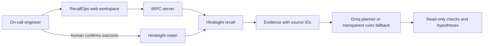

# RecallOps

**Incident response that remembers.** RecallOps helps on-call engineers investigate repeat incidents by retrieving relevant postmortems, highlighting both failed fixes and verified resolutions, and turning that evidence into a cautious investigation plan.

> RecallOps is advisory only. It does not connect to production systems, execute commands, restart services, roll back releases, or change infrastructure.

## The problem

Incident knowledge is scattered across tickets, chat threads, and postmortems. During an outage, responders lose time rebuilding context—and can repeat a fix that already failed. RecallOps connects today's symptoms and recent changes to the team's historical experience, then makes the supporting evidence inspectable.

## What the demo does

1. **Describe an incident** — Choose one of three clearly labelled fictional scenarios or enter synthetic symptoms, service, environment, impact, and recent change.
2. **Recall relevant experience** — Hindsight retrieves related memories. The UI shows source IDs and whether evidence is live Hindsight memory, synthetic sample data, or a browser-local lesson.
3. **Build an investigation plan** — Groq can reason over the current report and cited evidence. Without Groq credentials, an evidence-guided rules fallback keeps the demo functional and identifies itself honestly.
4. **Compare memory vs. no memory** — A side-by-side panel makes the value of prior experience visible. A past incident is framed as a hypothesis to test, never as proof.
5. **Close the learning loop** — An engineer records a confirmed root cause, failed actions, successful resolution, and follow-up lesson. A required human confirmation precedes saving.
6. **Use that lesson next time** — In live mode, the lesson is retained in Hindsight and can inform later recall. In simulation mode, the lesson is stored only in that browser's local storage.

## Why Hindsight is central

RecallOps uses Hindsight as a persistent experience layer, not a transcript cache or an extra database:

- **Recall:** the server calls the official `@vectorize-io/hindsight-client` SDK with the incident service, symptoms, and recent change. Retrieved facts are assigned citation IDs and shown next to the recommendation they informed.
- **Retain:** only a human-confirmed postmortem is sent to Hindsight, including what failed, what worked, and a caution that historical similarity is not proof.
- **Idempotent demo seeding:** synthetic postmortems use stable document IDs, so loading the sample pack again updates those demo documents instead of duplicating them.
- **Learning progression:** a retained outcome can change evidence and prioritization on a later analysis. This is memory-augmented reasoning; **the language model is not being retrained**.

The memory bank defaults to `recallops-hackathon-demo`. For a production product, use authenticated, tenant-scoped banks and access controls rather than a shared public demo bank.

## Architecture



**Stack:** React + TypeScript + Tailwind, tRPC, Node/Express, the official Hindsight TypeScript client, and optional Groq Chat Completions. Credentials are read server-side only; they are never sent to the browser.

## Run locally

Requirements: Node.js 20+ and pnpm.

```bash
pnpm install
# Optional: set HINDSIGHT_API_URL, HINDSIGHT_API_KEY, and GROQ_API_KEY
# in the server process environment. Never use a VITE_ prefix for secrets.
pnpm dev
```

Open the local URL printed by the dev server. The app works without credentials in **simulation mode** using fictional seed incidents. Simulation mode is visibly labelled; its postmortems are persisted to that browser only, not to Hindsight.

### Optional integrations

| Variable | Purpose |
| --- | --- |
| `HINDSIGHT_API_URL` | Base URL of your Hindsight API instance (omit `/v1`); obtain the correct URL from your Hindsight deployment or Cloud settings. |
| `HINDSIGHT_API_KEY` | Optional for local/self-hosted Hindsight with auth disabled; set the server-side bearer key when API-key auth is enabled. |
| `HINDSIGHT_BANK_ID` | Memory bank name; defaults to `recallops-hackathon-demo`. |
| `GROQ_API_KEY` | Optional server-side key for Groq evidence-grounded plan generation. |
| `GROQ_MODEL` | Optional Groq model name; defaults to `openai/gpt-oss-120b`. |

`HINDSIGHT_API_URL` can point to Hindsight Cloud or a self-hosted API. Hindsight bearer authentication uses `Authorization: Bearer <key>` through the official SDK. Never put either provider key in a `VITE_` variable, client code, screenshots, or a public commit. See the [Hindsight quickstart](https://hindsight.vectorize.io/developer/api/quickstart), [retain guide](https://hindsight.vectorize.io/developer/api/retain), and [recall guide](https://hindsight.vectorize.io/developer/api/recall).

The optional Groq path defaults to `openai/gpt-oss-120b` and requests strict JSON Schema output, then validates evidence IDs and filters unsafe action-like recommendations. See the [official Groq model page](https://console.groq.com/docs/model/openai/gpt-oss-120b), [Structured Outputs guide](https://console.groq.com/docs/structured-outputs), and [`docs/GROQ_REFERENCES.md`](docs/GROQ_REFERENCES.md).

When a Hindsight URL is configured, select **Memory bank → Load synthetic pack into Hindsight** to retain the sample postmortems. Then return to **Incident room**, choose a scenario, and run analysis. After entering a verified outcome, save it and re-run analysis to demonstrate the feedback loop.

### Data handling and limitations

- The hosted hackathon demo is intended for **fictional/synthetic incident data only**. Do not enter production logs, personal information, credentials, or secrets.
- The server redacts common token/key patterns before sending user text to configured external APIs; this is a safeguard, not a guarantee of complete secret detection.
- API keys stay server-side. Demo endpoints are rate-limited but are not a substitute for production authentication, tenant isolation, or a formal abuse-control policy.
- A Hindsight URL failure is surfaced as synthetic fallback evidence, explicitly marked as such. An empty live bank is not silently represented as a successful recall.
- Recommendations are hypotheses. The interface requests read-only checks, filters unsafe action-like model output, and never executes a remediation.
- Synthetic metrics and incident histories are illustrative, not measured production results. No accuracy or time-saving claims are made.
- The in-browser simulation stores outcomes in `localStorage`; live Hindsight mode retains confirmed outcomes in the configured bank.

## Verify

```bash
pnpm check
pnpm test
pnpm build
```

## Hackathon demo flow

1. Open the **Checkout 502s** synthetic scenario and point out the recent worker-concurrency change.
2. Analyze and inspect `[E1]`: a fictional earlier incident where restarts failed and a verified config rollback restored service.
3. Show the memory delta: generic release/metrics checks become a more specific *hypothesis* to compare configuration and queue telemetry—still not a confirmed diagnosis.
4. Record a human-confirmed outcome, explicitly noting what failed and what resolved it.
5. Run analysis again. Show the newly retained or browser-local lesson as evidence and explain the difference between live Hindsight and simulation mode.

A fuller timed script, article draft, and social copy are in [`docs/SUBMISSION_KIT.md`](docs/SUBMISSION_KIT.md).

## Project status

This repository contains the interactive hackathon demo and setup/submission materials. A real multi-tenant production rollout would still require authenticated user access, bank-per-tenant isolation, stronger abuse controls, integration with an organization's incident system, and reliability testing against its own postmortems.
