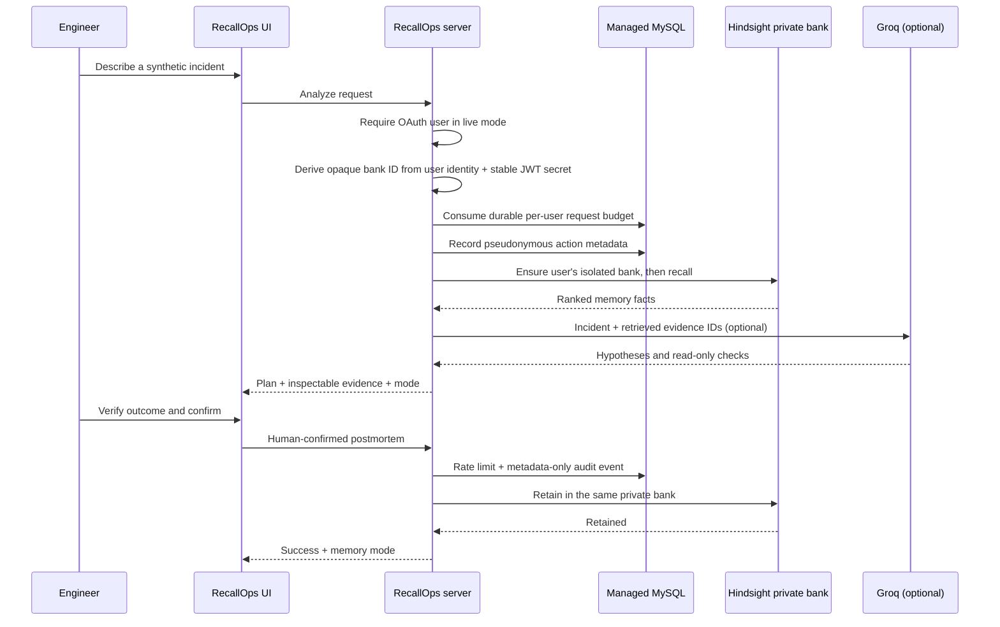

# RecallOps architecture notes

## Request path

If `HINDSIGHT_API_URL` is unset, the app selects an explicitly labelled public simulation path: fictional seed examples plus browser-local outcome storage. In live mode, sign-in is mandatory; anonymous requests cannot access, seed, analyze against, or retain into Hindsight. Each account receives a stable opaque bank ID derived with HMAC from its OAuth identity and the server-side `JWT_SECRET`. The ID and raw OAuth identity are not exposed to the browser or stored in the app's audit log.

## Trust boundaries and persistence

- **Browser:** incident form, evidence viewer, human confirmation, and simulation-only local storage. The browser cannot choose a bank ID.
- **RecallOps server:** Manus OAuth context, Hindsight/Groq credentials, HMAC-derived bank and actor identifiers, input redaction, response validation, durable limits, and audit events.
- **Managed MySQL:** stores the existing OAuth user records, a rolling request counter keyed by pseudonymous actor hash, and minimal audit metadata. Live requests are limited to 30 per user per minute and fail closed if durable controls are unavailable.
- **Audit retention:** logs contain only a pseudonymous actor hash, action, fixed target label, and timestamps. They never contain incident text, email, OAuth IDs, API keys, or provider response bodies. Expired audit metadata is purged on the next audit write; retention is 30 days.
- **Hindsight:** one isolated bank per authenticated user. Bank setup and all recall/retain operations are server-side. Provider-side memory retention is controlled by the Hindsight deployment and is separate from the app audit TTL.
- **Groq:** optional generation from the current incident plus retrieved evidence. The model is instructed to produce hypotheses and read-only checks only. Output is validated, unsafe action-like recommendations are dropped, and evidence IDs must match the retrieved evidence set.

Keep `JWT_SECRET` stable. Rotating it changes the HMAC-derived bank ID; perform a deliberate bank migration before rotating the secret if access to existing memories must be preserved.

## Deliberate constraints

1. No production telemetry/ticketing integrations, shell execution, infrastructure write actions, restart, rollback, scale, or automated remediation.
2. A model's recommendation is not treated as a verified incident fact.
3. Only a user-confirmed outcome is eligible for retain.
4. Synthetic demo content is labelled separately from live Hindsight memories.
5. Common secret patterns are redacted before external calls, but redaction is not a guarantee; use synthetic data in the public demo.
6. Browser-local simulation outcomes are not shared across users and never influence live Hindsight analyses.
