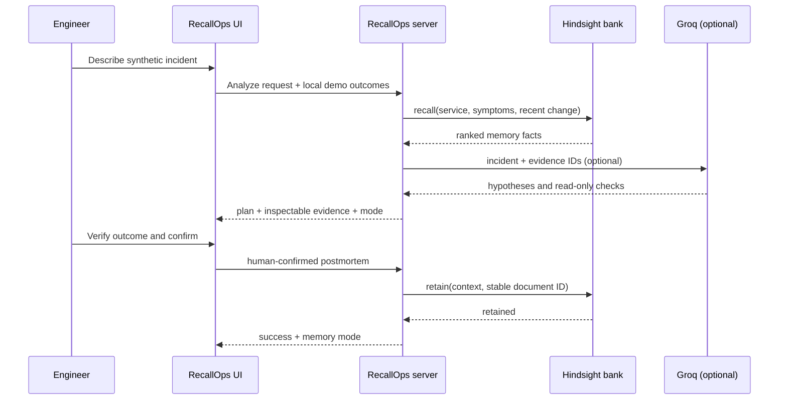

# RecallOps architecture notes

## Request path

If `HINDSIGHT_API_URL` is unset, the app selects an explicitly labelled simulation path: fictional seed examples plus browser-local outcome storage. It does not claim that localStorage is Hindsight. If Hindsight is configured but unavailable for a request, the server labels fallback evidence instead of reporting a successful live recall.

## Trust boundaries

- **Browser:** incident form, evidence viewer, human confirmation, and simulation-only local storage.
- **RecallOps server:** Hindsight SDK credentials, optional Groq key, input redaction, response validation, and public-demo request limits.
- **Hindsight:** persistent memory bank and retrieval. The demo uses a shared configured bank ID; production requires tenant-specific identity and authorization.
- **Groq:** optional generation from the current incident plus retrieved evidence. The model is instructed to produce hypotheses and read-only checks only. Output is validated, unsafe action-like checks are dropped, and evidence IDs must match the retrieved evidence set.

## Deliberate constraints

1. No production integrations, shell execution, write actions, restart, rollback, scale, or automated remediation.
2. A model's recommendation is not treated as a verified incident fact.
3. Only a user-confirmed outcome is eligible for retain.
4. Synthetic demo content is labelled separately from live Hindsight memories.
5. Common secret patterns are redacted before external calls, but redaction is not a guarantee; the public demo should use synthetic data only.
